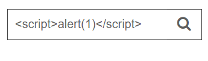
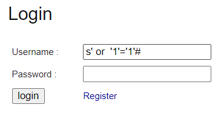
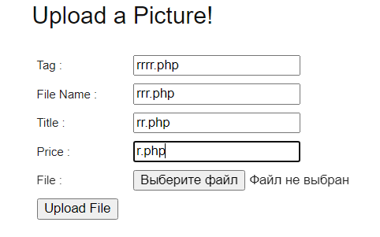
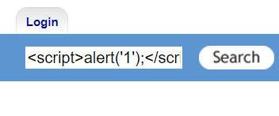
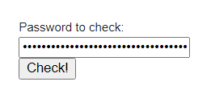
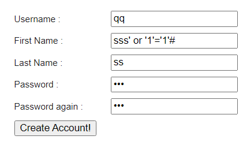
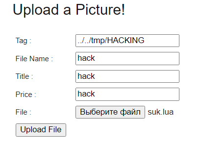
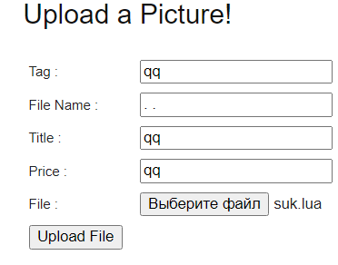

# Дипломная работа по профессии «Специалист по информационной безопасности»
## Penetration Testing
### Задача

Нужно протестировать сервис на безопасность — провести полноценое тестирование на проникновение методом чёрного ящика. Известен только адрес тестируемого приложения — 92.51.39.106.
* fff
## Отчет по работе
### OSINT
* Google
    * При исследовании с помощью “google dorking”, нам удалось найти отчет о сканировании этого ip адреса на сайте [criminalip.io](https://www.criminalip.io/asset/report/92.51.39.106)(ссылка ведет на отчет). 
        * Из этого отчета мы можем узнать, что на данном сервисе открыты 3 порта:
            * 22 - OpenSSH version 8.2p1
            * 7799 - Web-service на Tornado version 5.1.1
            * 8060 - Web-service на Apache version 2.4.7
* Shodan
    * При исследовании с помощью “[Shodan](https://www.shodan.io/host/92.51.39.106)”, удалось дополнительно выяснить, что операционная система приложения - Ubuntu
* Whois
    * Был проведен поиск дополнительной информации посредством whois, который не дал дополнительно значимые данные. 
* CVE Details
    * При исследовании найденных служб и их версий было выявлено ряд уязвимостей: \
    [Отчет](Отчеты/CVE_Details.md)
### Scanning
* Nmap
    * Был проведен скан приложения на объект размещенных служб, их версий, и наличии уязвимостей, результат сканирования прикреплен файлом([nmap_scan.txt](Отчеты/nmap_scan.txt))
    * Были найдены дополнительные службы:
        * 25(filtered) - smtp
        * 553(filtered) - pirp
        * 6862(filtered) - unknown
        * 10033(filtered) - unknown
        * 10050 - zabbix-agent
        * 11495(filtered) - unknown
        * 13717(filtered) - unknown
        * 23744(filtered) - unknown
        * 30288(filtered) - unknown
        * 31910(filtered) - unknown
        * 37811(filtered) - unknown
        * 58914(filtered) - unknown
        * 64047(filtered) - unknown
    * Было выявлено ряд уязвимостей ранее найденных служб:\
    [Отчет](Отчеты/nmap_scan.txt)
* OpenVas
    * Был проведен скан с использованием openvas конфигурации ([openvas.html](Отчеты/openvas.html)) и с использованием базы CVE ([openvas_CVE.html](Отчеты/openvas_CVE.html))
### Testing
- Ручной поиск уязвимости
    - Port: 7799
        - Была выявлена критическая уязвимость **SQL-injection** в поле username в форме авторизации, Эксплуатация:
            1. Перейти по url=”<http://92.51.39.106:7799/login.html>”
            2. Ввести данные данные в форму
            3. Нажать кнопку “Login”

            #### Рекомендация по устранению:

            - Использовать параметризованные запросы к базам данным чтобы отделить пользовательский ввод

        * Была выявлена критическая уязвимость **SQL-injection** в поле password в форме авторизации, Эксплуатация:
            1. Перейти по url=”<http://92.51.39.106:7799/login.html>”
            2. Ввести данные данные в форму
            3. Нажать кнопку “Login”

            #### Рекомендация по устранению:

            - Использовать параметризованные запросы к базам данным чтобы отделить пользовательский ввод

        - Была выявлена отраженная критическая уязвимость **XSS(reflected)** в строке поиска, Эксплуатация:
            1. Перейти по url=“<http://92.51.39.106:7799/index.html>”
            2. Ввести данные данные в форму в верхнем правом углу
            3. Нажать на значок лупы

            #### Рекомендация по устранению:

            - Поставить заголовок X-XSS-Protection

        - Была выявлена критическая уязвимость **command injection**, Эксплуатация:
            1. Перейти по url=“<http://92.51.39.106:7799/server.html>”
            2. Ввести данные данные в форму
            3. Нажать на кнопку “Check”

            #### Рекомендация по устранению:

            - Сделать фильтр который проверяет, что входные данные содержат только буквенно-цифровые символы, никакого другого синтаксиса или пробелов.

        - Была выявлена критическая уязвимость обход пути(**path traversal**), Эксплуатация:
            1. Перейти по url=”<http://92.51.39.106:7799/read?file=..%2f..%2f..%2f..%2f..%2fetc%2fpasswd>”

            #### Рекомендация по устранению:

            - Сделать фильтр на ввод не допускающий специальных символов вроде . или / или %2f и т.д.

    - Port: 8060
        - Была выявлена критическая уязвимость **SQL-injection** в поле username в форме авторизации, Эксплуатация:
            1. Перейти по url=“<http://92.51.39.106:8060/users/login.php>”
            2. Ввести данные данные в форму\
            
            3. Нажать кнопку “login”

            #### Рекомендация по устранению:

            - Использовать параметризованные запросы к базам данным чтобы отделить пользовательский ввод

        - Была выявлена критическая уязвимость **Stored XSS**, Эксплуатация:
            1. Перейти по url=“<http://92.51.39.106:8060/users/login.php>”
            2. Авторизируйтесь либо зарегистрируйтесь под любым пользователем
            3. Перейдите по url=”<http://92.51.39.106:8060/pictures/view.php?picid=15>”(параметр можно выбрать любой доступный)
            4. В форме комментария вводим следующие данные
            5. Нажать на кнопку “Preview”
            6. На на кнопку “Create”

            #### Рекомендация по устранению:

            - формирование content security policy, которая запрещает на портале межсайтовый скриптинг
            - Добавить WAF
        - Была выявлена критическая уязвимость **Stored XSS**, Эксплуатация:
            1. Перейти по url=”<http://92.51.39.106:8060/guestbook.php>”
            2. В форме комментария ввести следующие данные
            3. Нажать кнопку “Submit”

            Рекомендация по устранению:

            - формирование content security policy, которая запрещает на портале межсайтовый скриптинг
            - Добавить WAF
        - Была выявлена критическая уязвимость создание веб-оболочки через загрузку вредоносного файла(**File upload vulnerabilities**), Эксплуатация:
            1. Перейти по url=“<http://92.51.39.106:8060/users/login.php>”
            2. Авторизируйтесь либо зарегистрируйтесь под любым пользователем
            3. Создайте на своем персональном рабочем месте текстовый файл с произвольным названием и занесите в этот файл следующую строку = **<?php echo system($\_GET['command']); ?>,** после измените расширение файла на **.php,** чтобы у вас в итоге был файл с таким названием = **{Ваше произвольное название}.php**
            4. Перейти по url=“<http://92.51.39.106:8060/pictures/upload.php>”
            5. Введите следующие данные в формы 
            6. Нажать “Выберите файл” и загрузить созданный нами файл
            7. Нажать “Upload File”
            8. Перейти по url=“<http://92.51.39.106:8060/upload/rrrr.php/rrr.php?command=whoami>”

            #### Рекомендация по устранению:

            - Создать **белый** список разрешенных расширений файла и проверять загруженные файлы по нему
            - Фильтровать ввод в “File name” и запрещать ввод пользовательского расширения файла

        - Была выявлена критическая уязвимость **отраженная XSS(reflected)**, Эксплуатация:
            1. перейти по url “<http://92.51.39.106:8060/users/login.php>”
            2. Ввести данные “” в форму поиска справа вверху
            3. Нажать “Search”

            #### Рекомендация по устранению:

            - формирование content security policy, которая запрещает на портале межсайтовый скриптинг
            - Добавить WAF

        - Была выявлена критическая уязвимость **command injection** в форме проверка устойчивости пароля, Эксплуатация
            1. перейти по url = “<http://92.51.39.106:8060/passcheck.php>”
            2. Ввести следующие данные в форму = “123$ $(ping -c 10 localhost) /var/log/bootstrap.log #” 
            3. Нажать кнопку “Check”

            **Пояснение:** данной инъектированой командой - “ping -c 10 localhost” мы пытаемся создать задержку в ответе сервера(приблизительно 10 секунд). Отправив полезную нагрузку на сервер, мы можем наблюдать задержку на ответ от сервера, что говорит, что мы удачно инъектировали команду.

            #### Рекомендация по устранению:

            - Использовать функцию *escapeshellarg($pass)* для экранирования специальных символов
            - По возможности не использовать оболочку shell

        - Была выявлена критическая уязвимость **SQL injection** на странице поиска пользователей к похожим именем. Эксплуатация
            1. перейти по url = “<http://92.51.39.106:8060/users/register.php>” 

            2. Зарегистрируйте любого пользователя у которого “First Name” = “sss’ or ‘1’=’1’#”(Пример ниже на скриншоте)\
            
            3. После регистрации перейдите по url = “<http://92.51.39.106:8060/users/similar.php>”

            #### Рекомендация по устранению:

            - Использовать параметризованные запросы к базам данным чтобы отделить пользовательский ввод
            - Была выявлена критическая уязвимость **command injection** в GET запросе к check\_pass.php
                1. перейти по url = “<http://92.51.39.106:8060/users/check_pass.php?password=ss;%20ping%20-c%2010%20localhost>”

                **Пояснение:** Если раскодировать строку значение параметра *password*, то получиться данная полезная нагрузка - “*ss; ping -c 10 localhost*”, в которой мы пытаемся создать задержку в ответе сервера(приблизительно 10 секунд). Отправив полезную нагрузку на сервер, мы можем наблюдать задержку на ответ от сервера, что говорит, что мы удачно инъектировали команду

                #### Рекомендация по устранению:

                - Использовать функцию *escapeshellarg($pass)* для экранирования специальных символов
                - По возможности не использовать оболочку shell

            - Была выявлена высокая уязвимость **IDOR** в GET запросе к sample.php
                1. Не авторизовывайтесь используйте url=”<http://92.51.39.106:8060/users/sample.php?userid=2>”, изменяя параметр userid на любое положительное целое число, чтобы получить информацию о пользователях.

               #### Рекомендация по устранению:

                - Сделайте проверку пользователя на авторизацию
            - Была выявлена средняя уязвимость **path traversal** в форме отправки файла на сервер. Эксплуатация:
                1. Авторизуйтесь либо зарегистрируйтесь под любым пользователем
                2. Перейдите по url = ”<http://92.51.39.106:8060/pictures/upload.php>”
                3. Введите форму следующие данные и приложите произвольный файл
                4. Нажмите на “Upload File”

                **Пояснение:** Мною была проверена эта уязвимость на positive срабатывание с помощью уязвимости iv - **File upload vulnerabilities,** которая создает веб оболочку.

                

                #### Рекомендация по устранению:

                * Проверяйте вводимые пользователем данные перед их обработкой. В идеале, сравните вводимые пользователем данные с белым списком разрешенных значений. Если это невозможно, убедитесь, что входные данные содержат только разрешенное содержимое, например, только буквенно-цифровые символы.

            - Была выявлена средняя уязвимость **path traversal** в форме отправки файла на сервер. Эксплуатация:
                1. Авторизуйтесь либо зарегистрируйтесь под любым пользователем
                2. Перейдите по url = ”<http://92.51.39.106:8060/pictures/upload.php>”
                3. Введите форму следующие данные и приложите произвольный файл
                4. Нажмите “Upload File”

                **Пояснение:** Мною была проверена эта уязвимость на positive срабатывание с помощью уязвимости iv - **File upload vulnerabilities,** которая создает веб оболочку.

                

                #### Рекомендация по устранению:

                Проверяйте вводимые пользователем данные перед их обработкой. В идеале, сравните вводимые пользователем данные с белым списком разрешенных значений. Если это невозможно, убедитесь, что входные данные содержат только разрешенное содержимое, например, только буквенно-цифровые символы.

- Автоматический поиск:
    - Port: 7799
        - Был проведен автоматический поиск уязвимости с помощью **owasp zap 2.14.0**, прикреплю результат отчета как файл ([owasp\_zap\_7799.html](Отчеты/owasp_zap_7799.html))
    - Port: 8060
        - Был проведен автоматический поиск уязвимости с помощью **owasp zap 2.14.0,** прикреплю результат отчета как файл ([owasp\_zap\_8060.html](Отчеты/owasp_zap_8060.html))
        
        

    

